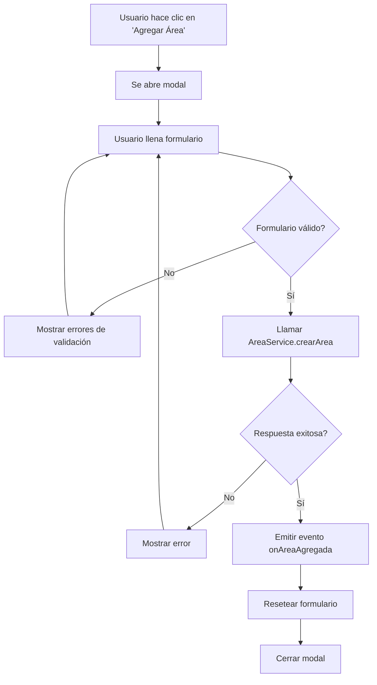

# Componente AgregarArea

## 📋 **Descripción**

Componente modal para agregar nuevas áreas de operación. Implementa un formulario reactivo con validaciones y manejo de estados de carga y error.

## 🎯 **Características**

### **✅ Funcionalidades principales:**
- Formulario reactivo con validaciones
- Manejo de estados (loading, error, success)
- Comunicación con componente padre mediante eventos
- Diseño responsive con PrimeNG
- Validaciones en tiempo real
- Mensajes de error descriptivos

### **✅ Campos del formulario:**
- **Nombre**: Campo requerido (3-100 caracteres)
- **Externo**: Checkbox para indicar si es área externa
- **Generar Folio**: Checkbox para habilitar generación automática de folios

## 🔧 **Uso del componente**

### **En el template padre:**
```html
<app-agregar-area 
    [visible]="mostrarModal"
    [departamentoId]="departamentoActual()"
    (onAreaAgregada)="onAreaAgregada($event)"
    (onCancelar)="onCancelarAgregarArea()" />
```

### **En el componente padre:**
```typescript
export class WorkspaceComponent {
    mostrarModal = signal<boolean>(false);
    departamentoActual = signal<number>(12);
    
    abrirModalAgregar(): void {
        this.mostrarModal.set(true);
    }
    
    onAreaAgregada(nuevaArea: Area): void {
        // Agregar área a la lista
        const areas = this.areas();
        this.areas.set([...areas, nuevaArea]);
        
        // Cerrar modal
        this.mostrarModal.set(false);
        
        console.log('Área agregada:', nuevaArea);
    }
    
    onCancelarAgregarArea(): void {
        this.mostrarModal.set(false);
    }
}
```

## 📝 **API del componente**

### **Inputs:**
```typescript
visible = input<boolean>(false);        // Controla la visibilidad del modal
departamentoId = input<number>();       // ID del departamento para el área
```

### **Outputs:**
```typescript
onAreaAgregada = output<Area>();        // Emite cuando se crea un área exitosamente
onCancelar = output<void>();            // Emite cuando se cancela la operación
```

## 🎨 **Estructura del formulario**

```typescript
areaForm = this.fb.group({
    nombre: ['', [
        Validators.required, 
        Validators.minLength(3), 
        Validators.maxLength(100)
    ]],
    externo: [false],
    generarFolio: [true]
});
```

## 🔍 **Validaciones**

### **Campo Nombre:**
- ✅ Requerido
- ✅ Mínimo 3 caracteres
- ✅ Máximo 100 caracteres

### **Validación visual:**
- Campos con error muestran borde rojo
- Mensajes de error descriptivos
- Validación en tiempo real al tocar campos

## 🚀 **Estados del componente**

### **Loading:**
- Botones deshabilitados
- Spinner en botón "Guardar"
- Campos del formulario deshabilitados

### **Error:**
- Mensaje de error visible
- Formulario habilitado para corrección
- Botón "Guardar" habilitado

### **Success:**
- Evento `onAreaAgregada` emitido
- Formulario reseteado
- Modal cerrado automáticamente

## 🔧 **Integración con AreaService**

El componente utiliza el método `crearArea` del AreaService:

```typescript
this.areaService.crearArea(nuevaArea, departamentoId)
    .pipe(finalize(() => this._loading.set(false)))
    .subscribe({
        next: (response) => {
            if (response.data) {
                this.onAreaAgregada.emit(response.data);
                this.resetearFormulario();
            }
        },
        error: (error) => {
            this._error.set('Error al crear el área. Por favor, intente nuevamente.');
        }
    });
```

## 📱 **Diseño responsive**

### **Desktop:**
- Modal centrado con ancho fijo
- Botones alineados horizontalmente

### **Mobile:**
- Modal ocupa 95% del viewport
- Botones apilados verticalmente
- Campos de formulario adaptados

## 🎯 **Mejores prácticas implementadas**

### **Angular 20:**
- ✅ Signals para estado reactivo
- ✅ Input/Output signals
- ✅ Formularios reactivos
- ✅ Standalone components

### **UX/UI:**
- ✅ Validaciones en tiempo real
- ✅ Estados de carga claros
- ✅ Mensajes de error descriptivos
- ✅ Diseño responsive

### **Código:**
- ✅ Separación de responsabilidades
- ✅ Métodos pequeños y enfocados
- ✅ Manejo robusto de errores
- ✅ Documentación completa

## 🔄 **Flujo de trabajo**



## 🧪 **Testing**

### **Casos de prueba sugeridos:**
1. **Validaciones de formulario**
2. **Creación exitosa de área**
3. **Manejo de errores de API**
4. **Cancelación de operación**
5. **Estados de loading**
6. **Responsive design**

### **Ejemplo de test:**
```typescript
describe('AgregarAreaComponent', () => {
    it('should emit onAreaAgregada when area is created successfully', () => {
        // Arrange
        const mockArea: Area = { id: 1, nombre: 'Test Area' };
        spyOn(component.onAreaAgregada, 'emit');
        
        // Act
        component.areaForm.patchValue({
            nombre: 'Test Area',
            externo: false,
            generarFolio: true
        });
        component.onSubmit();
        
        // Assert
        expect(component.onAreaAgregada.emit).toHaveBeenCalledWith(mockArea);
    });
});
```
